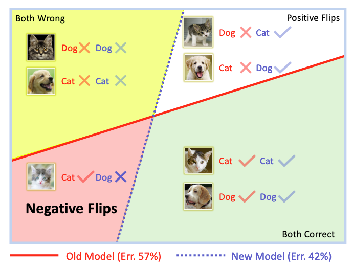

# Regression Constraint Model Upgrade 

## Introduction

The inconsistency in the behaviour of different versions of an AI module may bringsignificant instability to the overall system.  While an improved module usuallyreduces the average number of errors, it always introduces new ones when compared to its predecessor.  This phenomenon is known as **regression**. 

This repository holds the codebase for exploring regression problem in classification task. It provides training scripts for mainstream network architectures and analysis tools for evaluating regression extent among them. 



## Installation

- Install [Anaconda (with python3.7)](https://www.anaconda.com/products/individual) 
- Install the dependencies with `pip install -r ConstrainedUpgrade/requirements.txt`
- Download the ImageNet dataset from http://www.image-net.org/
    - Then, and move validation images to labeled subfolders, using [this shell script](https://raw.githubusercontent.com/soumith/imagenetloader.torch/master/valprep.sh).
    
## Training

To train a model, run `ConstrainedUpgrade/main.py` with the desired model architecture and the path to the ImageNet dataset:

```bash
python ConstrainedUpgrade/train.py -a resnet18 [imagenet-folder with train and val folders]
```

The default learning rate schedule starts at 0.1 and decays by a factor of 10 every 30 epochs. This is appropriate for ResNet and models with batch normalization, but too high for AlexNet and VGG. Use 0.01 as the initial learning rate for AlexNet or VGG:

```bash
python ConstrainedUpgrade/train.py -a alexnet --lr 0.01 [imagenet-folder with train and val folders]
```

## Multi-processing Distributed Data Parallel Training

You should always use the NCCL backend for multi-processing distributed training since it currently provides the best distributed training performance.

### Single node, multiple GPUs:

```bash
python ConstrainedUpgrade/train.py -a resnet50 --dist-url 'tcp://127.0.0.1:FREEPORT' --dist-backend 'nccl' --multiprocessing-distributed --world-size 1 --rank 0 [imagenet-folder with train and val folders]
```

### Multiple nodes:

Node 0:
```bash
python ConstrainedUpgrade/train.py -a resnet50 --dist-url 'tcp://IP_OF_NODE0:FREEPORT' --dist-backend 'nccl' --multiprocessing-distributed --world-size 2 --rank 0 [imagenet-folder with train and val folders]
```

Node 1:
```bash
python ConstrainedUpgrade/train.py -a resnet50 --dist-url 'tcp://IP_OF_NODE0:FREEPORT' --dist-backend 'nccl' --multiprocessing-distributed --world-size 2 --rank 1 [imagenet-folder with train and val folders]
```

## Evaluation
The best model in training process will be evaluated automatically. The prediction outputs on validation set will be saved in the working folder `--work_dir`.

You can also evaluate model after training by:
```bash
python ConstrainedUpgrade/train.py --evaluate --resume $MODEL_PATH [other options]
```
. The results will be stored as `evaluate.result` in the working folder by default.

We also provide anylisis tools to calucate the statistic numbers such as accuracy and negative flip rate. Please refer to `ConstrainedUpgrade\analysis`. There is an example code snippet:
```python
from analysis.utils import ModelAnalizer
old_model = ModelAnalizer('{}/model_best.result'.format(work_dir_1))
new_model = ModelAnalizer('{}/model_best.result'.format(work_dir_2))
ensemble_model = old_model + new_model
print('Accuracy: {}, NFR: {}'.format(new_model.Acc(), new_model.NFR(old_model)))
print('Ensemble Accuracy: {}'.format(ensemble_model.Acc()))
```

## Commands

```
usage: ConstrainedUpgrade/train.py [-h] [-d DIR] [-w DIR] [-a ARCH]
                [--model_kwargs KEY=VAL [KEY=VAL ...]] [-j N] [--epochs N]
                [--start-epoch N] [-b N] [--lr LR] [--lr_step LR_STEP]
                [--momentum M] [--wd W] [-p N] [--resume PATH] [-e]
                [--evaluate_aux EVALUATE_AUX]
                [--evaluate_results_name EVALUATE_RESULTS_NAME] [--pretrained]
                [--world-size WORLD_SIZE] [--rank RANK] [--dist-url DIST_URL]
                [--dist-backend DIST_BACKEND] [--seed SEED] [--gpu GPU]
                [--multiprocessing-distributed]
                [--bct_loss_weight BCT_LOSS_WEIGHT]
                [--bct_old_model BCT_OLD_MODEL]
                [--bct_eval_alpha BCT_EVAL_ALPHA]
                [--kd_model_arch KD_MODEL_ARCH]
                [--kd_model_path KD_MODEL_PATH]
                [--kd_loss_weight KD_LOSS_WEIGHT]
                [--kd_temperature KD_TEMPERATURE]
                [--cna_temperature CNA_TEMPERATURE]
                [--kd_filter {all_pass,neg_flip,old_correct,new_incorrect}]
                [--kd_loss_mode {normal,gt}] [--auto-scale] [--auto-shotdown]
                [--save-init-checkpoint]

PyTorch ImageNet Training

optional arguments:
  -h, --help            show this help message and exit
  -d DIR, --data DIR    path to dataset
  -w DIR, --work_dir DIR
                        path to working folder
  -a ARCH, --arch ARCH  model architecture: AlexNet | AuxResNet | DenseNet |
                        GoogLeNet | GoogLeNetOutputs | Inception3 |
                        InceptionOutputs | MBResNet | MNASNet | MobileNetV2 |
                        ResNet | ResNet_StoDepth_lineardecay | ShuffleNetV2 |
                        SqueezeNet | VGG | alexnet | aux_resnet101 |
                        aux_resnet152 | aux_resnet18 | aux_resnet34 |
                        aux_resnet50 | densenet121 | densenet161 | densenet169
                        | densenet201 | googlenet | inception_v3 |
                        mb_resnet101 | mb_resnet152 | mb_resnet18 |
                        mb_resnet34 | mb_resnet50 | mnasnet0_5 | mnasnet0_75 |
                        mnasnet1_0 | mnasnet1_3 | mobilenet_v2 | resnet101 |
                        resnet101_StoDepth_lineardecay | resnet152 |
                        resnet152_StoDepth_lineardecay | resnet18 |
                        resnet18_StoDepth_lineardecay | resnet34 |
                        resnet34_StoDepth_lineardecay | resnet50 |
                        resnet50_StoDepth_lineardecay | resnext101_32x8d |
                        resnext50_32x4d | shufflenet_v2_x0_5 |
                        shufflenet_v2_x1_0 | shufflenet_v2_x1_5 |
                        shufflenet_v2_x2_0 | squeezenet1_0 | squeezenet1_1 |
                        vgg11 | vgg11_bn | vgg13 | vgg13_bn | vgg16 | vgg16_bn
                        | vgg19 | vgg19_bn | wide_resnet101_2 |
                        wide_resnet50_2 (default: resnet18)
  --model_kwargs KEY=VAL [KEY=VAL ...]
                        additional hyper-parameters for model
  -j N, --workers N     number of data loading workers (default: 4)
  --epochs N            number of total epochs to run
  --start-epoch N       manual epoch number (useful on restarts)
  -b N, --batch-size N  mini-batch size (default: 256), this is the total
                        batch size of all GPUs on the current node when using
                        Data Parallel or Distributed Data Parallel
  --lr LR, --learning-rate LR
                        initial learning rate
  --lr_step LR_STEP
  --momentum M          momentum
  --wd W, --weight-decay W
                        weight decay (default: 1e-4)
  -p N, --print-freq N  print frequency (default: 10)
  --resume PATH         path to latest checkpoint (default: none)
  -e, --evaluate        evaluate model on validation set
  --evaluate_aux EVALUATE_AUX
  --evaluate_results_name EVALUATE_RESULTS_NAME
                        name for saving the evaluate results
  --pretrained          use pre-trained model
  --world-size WORLD_SIZE
                        number of nodes for distributed training
  --rank RANK           node rank for distributed training
  --dist-url DIST_URL   url used to set up distributed training
  --dist-backend DIST_BACKEND
                        distributed backend
  --seed SEED           seed for initializing training.
  --gpu GPU             GPU id to use.
  --multiprocessing-distributed
                        Use multi-processing distributed training to launch N
                        processes per node, which has N GPUs. This is the
                        fastest way to use PyTorch for either single node or
                        multi node data parallel training
  --bct_loss_weight BCT_LOSS_WEIGHT
                        loss weight for backward compatible representation
                        learning
  --bct_old_model BCT_OLD_MODEL
                        source model for backward compatible representation
                        learning
  --bct_eval_alpha BCT_EVAL_ALPHA
                        ensemble alpha in evaluation stage for bct model
  --kd_model_arch KD_MODEL_ARCH
                        model architecture for knowledge distillation source.
  --kd_model_path KD_MODEL_PATH
                        model path of knowledge distillation source.
  --kd_loss_weight KD_LOSS_WEIGHT
                        loss weight of KD loss
  --kd_temperature KD_TEMPERATURE
                        temperature of KD loss (typically 10 - 100)
  --cna_temperature CNA_TEMPERATURE
                        temperature of CNA loss (typicaally 0.01)
  --kd_filter {all_pass,neg_flip,old_correct,new_incorrect}
                        the subset of training set applied KD loss
  --kd_loss_mode {normal,gt, l2, cna}
                        the supervision in knowledge distillation
  --auto-scale          auto scale learning rate and batch size by nodes
  --auto-shotdown       auto shotdown after training. (Only active for 8-gpu
                        servers)
  --save-init-checkpoint
                        save model after initialization before training
```

## Examples

Use focal distillation in training with Pytorch DDP. It automatically uses all GPUs available on a node. 
The KD loss tmperature is set to 100 and alpha=1, beta=5

```bash
python $BASEDIR/ConstrainedUpgrade/train.py \
--dist-url 'tcp://127.0.0.1:8000' --dist-backend 'nccl' --multiprocessing-distributed --world-size 1 --rank 0 \
--data ~/resource/imagenet/ --work_dir $SCRIPTDIR --seed 4331 \
--auto-scale --workers 2 --batch-size 160 --lr 0.1 --lr_step 30 --epochs 90 \
-a resnet18 \
--kd_model_arch resnet18 \
--kd_model_path FOLDER_OF_RESNET18/model_best.pth.tar \
--kd_loss_weight 1 --kd_alpha 0.9 --kd_loss_mode kl --kd_temperature 100 --kd_filter old_correct --filter-base 1 --filter-scale 5 \
2>&1 | tee -a $SCRIPTDIR/log.txt
```

Use the CNA in training with the Pytorh DDP. 
The CNA loss is set to temperature 0.01. By default it uses the outside log sum formulation. Beta=0 for the focal distillation. 

```bash
python $BASEDIR/ConstrainedUpgrade/train.py \
--dist-url 'tcp://127.0.0.1:8000' --dist-backend 'nccl' --multiprocessing-distributed --world-size 1 --rank 0 \
--data ~/resource/imagenet/ --work_dir $SCRIPTDIR --seed 4331 \
--auto-scale --workers 2 --batch-size 160 --lr 0.1 --lr_step 30 --epochs 90 \
-a resnet18 \
--kd_model_arch resnet18 \
--kd_model_path FOLDER_OF_RESNET18/model_best.pth.tar \
--kd_loss_weight 1 --kd_alpha 0.9 --kd_loss_mode cna --cna_temperature 0.01 --kd_temperature 100 --kd_filter old_correct --filter-base 1 --filter-scale 0 \
2>&1 | tee -a $SCRIPTDIR/log.txt
```

Use the LDI in training with the PyTorch DDP.
By default, we use LDI margin of 0.5, and p of 2. We can additional set "--li_compute_topk 10" to calculate the classes whose new logits are ranked highest. 

```bash
python $BASEDIR/ConstrainedUpgrade/train.py \
--dist-url 'tcp://127.0.0.1:8000' --dist-backend 'nccl' --multiprocessing-distributed --world-size 1 --rank 0 \
--data ~/resource/imagenet/ --work_dir $SCRIPTDIR --seed 1 \
--auto-scale --workers 4 --batch-size 128 --lr 0.1 --lr_step 30 --epochs 90 \
-a resnet50 \
--kd_model_arch resnet18 \
--kd_model_path FOLDER_OF_RESNET18/model_best.pth.tar \
--kd_loss_weight 1 --kd_alpha 0.5 --kd_loss_mode li --kd_filter all_pass \
--li_p 2 --li_margin 0.5 \
2>&1 | tee -a $SCRIPTDIR/log.txt
```

Use Ensemble Distillation with LDI in training with the PyTorch DDP.
Compared with single model+LDI, we set a smaller margin (--li_margin 0.2 or even 0) nad a larger KD loss weight (--kd_alpha 0.8).

```bash
python $BASEDIR/ConstrainedUpgrade/train.py \
--dist-url 'tcp://127.0.0.1:8000' --dist-backend 'nccl' --multiprocessing-distributed --world-size 1 --rank 0 \
--data ~/resource/imagenet/ --work_dir $SCRIPTDIR --seed 1 \
--auto-scale --workers 4 --batch-size 80 --lr 0.1 --lr_step 30 --epochs 90 \
-a resnet50 --kd_model_arch resnet50 \
--kd_model_path \
FOLDER_OF_RESNET18@SEED=1/model_best.pth.tar FOLDER_OF_RESNET18@SEED=2/model_best.pth.tar \
FOLDER_OF_RESNET18@SEED=3/model_best.pth.tar FOLDER_OF_RESNET18@SEED=4/model_best.pth.tar \
FOLDER_OF_RESNET18@SEED=5/model_best.pth.tar FOLDER_OF_RESNET18@SEED=6/model_best.pth.tar \
FOLDER_OF_RESNET18@SEED=7/model_best.pth.tar FOLDER_OF_RESNET18@SEED=8/model_best.pth.tar \
--kd_loss_weight 1 --kd_alpha 0.8 --kd_loss_mode li --kd_filter all_pass \
--li_p 2 --li_margin 0.0 \
--li_exclude_gt \
--save-init-checkpoint \
--epochs_per_save 1 \
2>&1 | tee -a $SCRIPTDIR/log.txt
```

## Citation

If this code helps your research or project, please cite

```
@inproceedings{yan2021positive,
  title={Positive-congruent training: Towards regression-free model updates},
  author={Yan, Sijie and Xiong, Yuanjun and Kundu, Kaustav and Yang, Shuo and Deng, Siqi and Wang, Meng and Xia, Wei and Soatto, Stefano},
  booktitle={Proceedings of the IEEE/CVF Conference on Computer Vision and Pattern Recognition},
  pages={14299--14308},
  year={2021}
}

@article{zhao2022elodi,
  title={ELODI: Ensemble Logit Difference Inhibition for Positive-Congruent Training},
  author={Zhao, Yue and Shen, Yantao and Xiong, Yuanjun and Yang, Shuo and Xia, Wei and Tu, Zhuowen and Shiele, Bernt and Soatto, Stefano},
  journal={arXiv preprint arXiv:2205.06265},
  year={2022}
}

@article{zhu2022contrastive,
  title={Contrastive Neighborhood Alignment},
  author={Zhu, Pengkai and Cai, Zhaowei and Xiong, Yuanjun and Tu, Zhuowen and Goncalves, Luis and Mahadevan, Vijay and Soatto, Stefano},
  journal={arXiv preprint arXiv:2201.01922},
  year={2022}
}
```

## Security

See [CONTRIBUTING](CONTRIBUTING.md#security-issue-notifications) for more information.

## License

This project is licensed under the Apache-2.0 License.

## Contribution
This codebase is built by [Sijie Yan](https://github.com/yysijie) and [Yue Zhao](https://github.com/zhaoyue-zephyrus) during their internship at [AWS Rekognition](https://aws.amazon.com/rekognition/) Team, under the supervision of [Yuanjun Xiong](https://github.com/yjxiong).
```
Sijie Yan: yysijie@gmail.com
Yue Zhao: yzhao@cs.utexas.edu
Yuanjun Xiong (mentor): yjxiong at ie.cuhk.edu.hk
```

## Contact
For any question, feel free to contact：
```
Yantao Shen: ytshen@link.cuhk.edu.hk
```